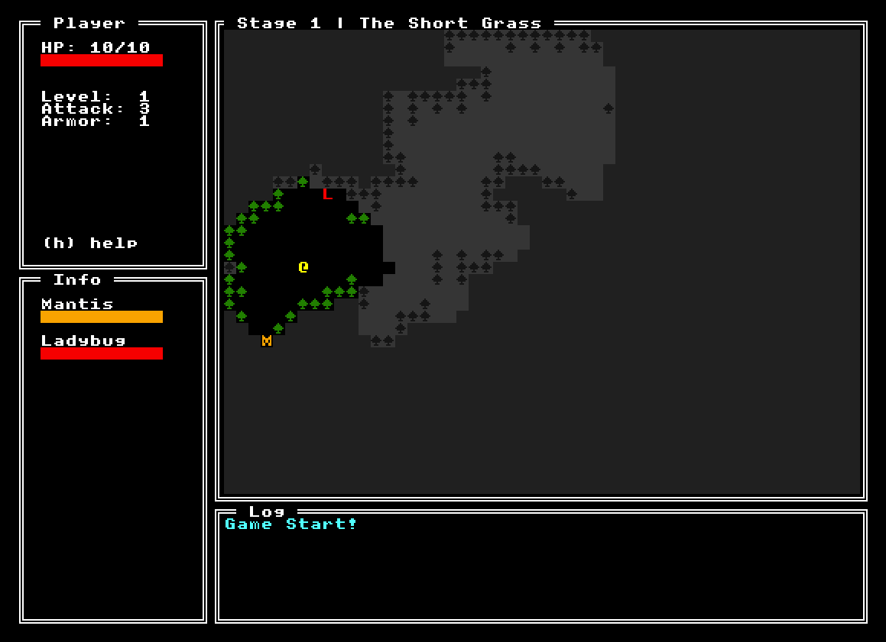

# Mal - 2021 7DRL

Help Mal the Snail ( @\_, ) find the mystic shell.

This project was made for the 2020 [7 Day Roguelike Contest](https://itch.io/jam/7drl-challenge-2021), using the [Malwoden](https://github.com/Aedalus/malwoden) JS/TS roguelike library created by the same team. The game focuses on a set of minimalistic roguelike mechanics, with a good degree of ascii polish. We invite you to check out the codebase if you're interested in using the library!
